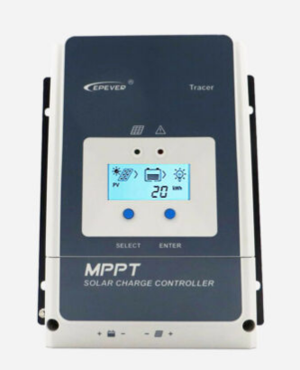
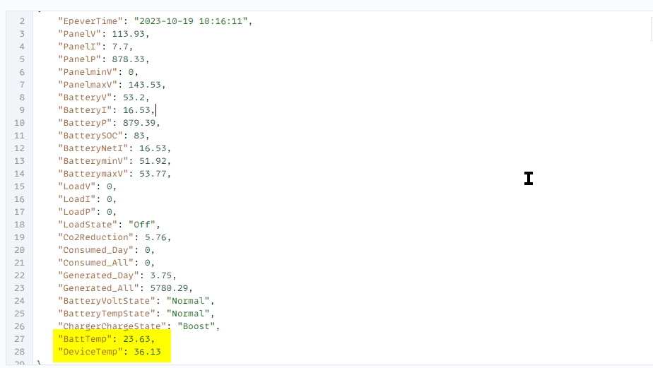

Was nett wäre, Vergesst bitte nicht meinen Kanal zu abonnieren und zu liken ;-) ... wann disliken gut wär, dann das auch :-))

https://www.youtube.com/c/BavarianSuperGuy

Ich übernehme keine Haftung für Schäden, die aufgrund der Nutzung 
der Software entstehen oder entstanden sind. 
Jeder ist für sein tun selber verantwortlich.
Mir sind keine Probleme bekannt.

3 Dinge sind wichtig für die Umsetzung dieses Projekts:
- 3,3V
- Guter Wlan Empfang(Keine Leerzeichen in der SSID vom Router)
- Readme vollstandig lesen, dann nochmal
wann readme gelesen wurde und ihr daraufhin gemerkt habt
aufgrund der Methode die beschrieben wird ,
der wlan empfang ist schlecht und lässt sich nicht ändern

... https://www.google.com/search?q=esp8266+antennenhack

ich kann keinen besseren Empfang programmiern!
und der esp kann auch nix anderes machen 
wann er ständig versucht sich  ins Wlan einzuloggen

# EspEpeverController mit Webseite 
Der Esp8266 ist über ein Rs485 Modul mit dem Epever Solar Laderegler verbunden und kann diesen die verfügbaren Daten auslesen bzw. auch das LoadReails des Tracer ein und ausschalten. 

Kurzum die Firmware die es hier zum Download gibt stellt ein Montitoring über Web bereit.
Getestet wurde die Kommunikation mitdem Tracer 10420 AN, warscheinlich funzt es für alle Epever.

Die Firmware(firmware_vX.X.X.X.bin") ist im Verzeichnis espflasher.
Diese kann unkompliziert auf einen 4Mbyte Esp mit dem im Verzeichnis enhaltenen
Tool "FlashESP8266.exe" geflasht werden. 
Dieses Tool FlashESP8266.exe ist nicht von mir , aber hat schon hevorragende Dienste geleistet.

Was kann der ESP8266 Epever Controller :

- Die blinkende Überschrift in der Webseite ist ein Alive zeichen , solange die Überschrift "ESP Herzschlag" blinkt , ist alles gut
- Es kann das Relais im Tracer für Load aus und eingeschalten werden.
- Anzeige aller verfügbaren Daten des Tracer in der Webseite
- Übermittlung per Mqtt aller verfügbaren Tracer Daten als Json Array  (Topic steht in der Webseite)
- Übermittlung per Webinterface  aller verfügbaren Tracer Daten als Json Array (Url steht in der Webseite)
- Anzeige der Wlan Signalstärke in der Webseite, je näher an 0 desto besser ist das Signal, z.B. 75 is grenzwertig OK 
(RSSI wird nicht aktualisiert, für aktuellen Wert, F5 im Browser drücken)
- Doppelreset implementierung um wieder ins Configportal im eigenen Esp AP zu kommen
- ElegantOta Implementierung für FirmwareUpdates
- ...

RS485 ttl Adapter (2 verschiedene getestet)
- rs485 adapter A an A von Epever Rj45(Pin5) anschliessen und Rs485 B an  Epever Rj45 B (Pin4)

- Beim "DI DE RE RO" Rs485 Modul
werden die mittleren Rs485 Pins "DE RE" auf einen Pin gebrückt an Esp GPIO0 angeschlossen.
Dann Rs485 "DI" auf Esp TX  und Rs485 "RO" auf Esp RX 

- Beim RX TX Rs485 Modul
wird der Rs485 TX mit Esp TX verbunden und Rs485 RX mit Esp RX verbunden , also nicht kreuzen!

!Vcc ist bei beiden Modulen 3.3volt!

Keinen USB/TTL Adapter als 3,3v Poduktiv Stromquelle verwenden, für erstflashen is es OK!

ESP:

EINRICHTUNG##############################################################################################
- 0.Bei Nutzung von Mqtt: Mqtt.fx Client öffnen mit Broker verbinden und Topic : 'Epever/#' abonnieren
- 0.1 Es kommt nach Schritt 8. ein Info Publish vom Esp mit der IP adresse.
- 0.2 Man kann die Ip Adresse nat. auch auf dem herkömmlichen Weg herausfinden
- 1.Firmware auf den gelöschten Esp8266 flashen
- 2.Esp Neustart
- 3.Im Wlan nach EPEVER_... suchen
- 4.Wlan mit Pwd 12345678 verbinden
- 5.Es öffnet sich automatisch Browser Fenster mit 192.168.4.1
- 6.Unter Configuration
- 6.1 Wifi auswählen oder eingeben und Passwort eingeben
- 6.2 Mqtt kann derzeit nur ohne ssl und sit Version 1.0.0.5 mit Benutzer/Passwort benutzt werden
- 7.Speichern mit dem Button ganz unten
- 8.Esp Neustart
- 9.Ipadresse in Mqtt Client oder Router ausfindig machen
EINRICHTUNG#############################################################################################

INBETRIEBNAHME##########################################################################################
- 1.Ipaddresse im browser aufrufen

INBETRIEBNAHME##########################################################################################

CONFIGPORTAL############################################################################################
Um im Nachhinein wieder ins Configportal zu kommen um die Wlan und Mqtt Daten zu ändern muss der 
- Pin RST vom ESP innerhalb 10sekunden 2X auf GND getippt werden
- Anwendungsbispiel: Taster 2mal hintereinander drücken
Daraufhin startet der ESP neu ins Configportal(EINRICHTUNG Punkt 3) , dort trägt man dann alle Daten neu ein, die fehlen
und klickt auf Save (Button ganz unten)
CONFIGPORTAL############################################################################################

Tip:
- Die Webschnittstelle für die Tracer Daten nur max alle 1-2 sekunden aufrufen

Epever Tracer Json Beispiel:

Falls Ihr mich unterstützen wollt, Spenden sind herzlich willkommen und würde mich sehr freuen :-)
Hier bitte - https://paypal.me/armerprogrammer
